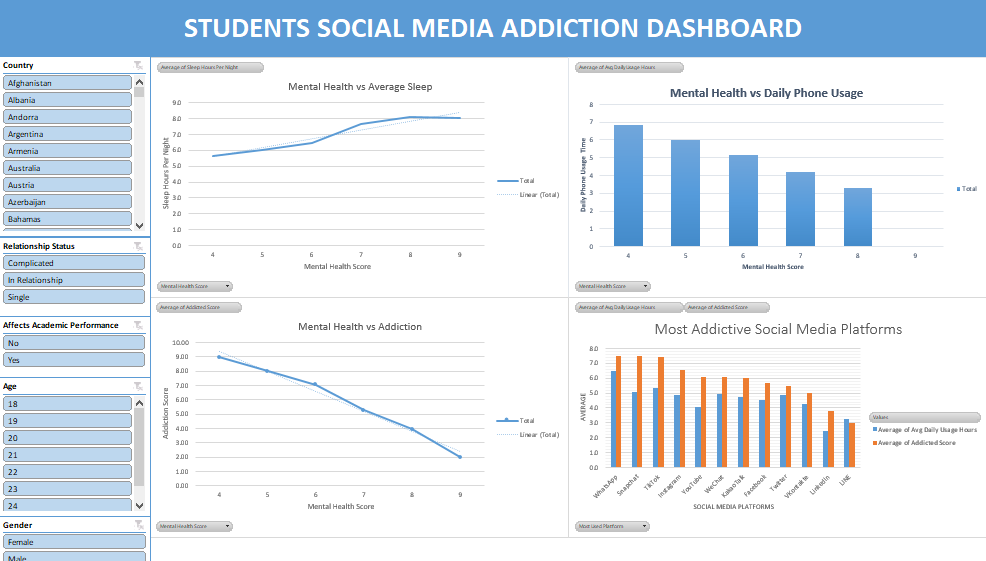

# Students-Social-Media-Addiction-Analysis
My first data analysis practice project using only excel to create dashboards and extract insights.

## Overview
This project surveyed 705 students to find a relationship between mental health, social media daily usage hours, social media addiction, and sleep hours. This project analyzes the data to find a correlation between these metrics. This project makes use of excel to analyze the data and create interactive dashboards

## Tools & Techniques Used
- Microsoft Excel
  - Data Cleaning
  - Pivot Tables & Charts
  - Slicers
  - Custom Formatting & Dashboard Layout

## Summary 
Students who used social media for an extensive period of time were found to sleep less and have a low mental health score but high addiction scores.
Below is an overview of the excel dashboard

## Insights
- The amount of sleep per night is directly proportional to the mental health score (though this varies subtly in some countries) showing that a healthy amount of sleep has a positive effect on mental health. Students with an average sleep time of 8 hours
- The more addicted the students were the less mentally healthy they were with the data showing that students with an addiction score of 9 had the lowest mental health score of 4. While students with an addiction score of 2 had the highest mental health s
- Mental health is inversely proprtional to average daily phone usage showing that too much screen time has a negative effect on mental health. Students with the highest daily phone usage time of close to 7 hours had the lowest mental health score of 4. W
- Students who used their phones for more than 4 hours daily found that it affected their studies.

## Recommendations
- Students should be limited to no more than 4 hours of screentime a day.
- Students should get about 7-8 hours of sleep daily.

## Author 
Jessica Nwoye
- LinkedIn - [Jessica Nwoye](www.linkedin.com/in/jessica-nwoye)
- GitHub - [Jessica Nwoye](https://github.com/JesNetWD)
